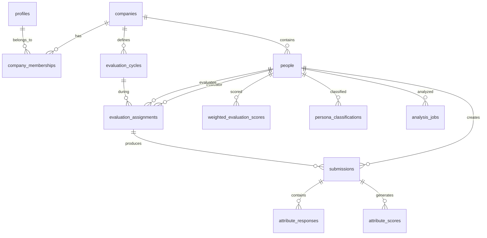

# Supabase Database Structure Reference

## 📚 Documentation Organization Summary

### Phase 1: Essential Core Documents (Keep & Maintain)
Based on workflow rules and active references, these are **mission-critical**:

**🔥 Active Core (Required by workflow):**
- `Implementation.md` - Main task reference (✅ Updated Feb 1, 2025)
- `project_structure.md` - Structure guidance (✅ Active)
- `UI_UX_doc.md` - Design requirements (✅ Active)
- `Bug_tracking.md` - Current issues (✅ Most recent: Aug 15)

### Phase 2: Archive-Ready Documents (Historical Value)
These appear to be **completed phases** with historical value:

**📚 Completed Projects:**
- All `/app_audit/*` files (Aug 14) - Audit complete
- All `/db_audit/*` files (Aug 14) - Database audit complete
- `rls_*` files (Aug 13) - RLS implementation complete
- `migration_completion_summary.md` - Migration done
- `Vite_Optimization_Summary.md` - Optimization complete
- `Week3_Caching_Implementation_Summary.md` - Caching complete

### Phase 3: Consolidation Candidates
These may have **overlapping content**:

**🔄 Potential Duplicates:**
- `cleanup_plan.md` vs `Code_Optimization_Tracking.md`
- Multiple email system docs vs single implementation
- `db_inventory.md` vs `db_post_migration_state.md`

### Phase 4: Utility Assessment
**🤔 Need Content Review:**
- `User_Guide.md` (July 18 - potentially outdated)
- `PDF_Generation_Analysis_Report.md` (Aug 13)
- `Comprehensive_database_schema.md` (Aug 12)

---

## 🗄️ **Supabase Database Structure Reference**

**Last Updated:** February 1, 2025  
**Migration Status:** All migrations applied through 0004  
**Database Version:** PostgreSQL 15.8

### 📋 **Quick Reference**

| Category | Tables | Purpose |
|----------|--------|---------|
| **Multi-Tenancy** | `companies`, `profiles`, `company_memberships`, `invites` | Core tenant isolation and user management |
| **People & Evaluation** | `people`, `evaluation_cycles`, `evaluation_assignments` | Core evaluation entities |
| **Survey Data** | `submissions`, `attribute_responses`, `attribute_scores` | Survey responses and scoring |
| **Analytics** | `weighted_evaluation_scores`, `core_group_*`, `persona_classifications` | Computed analytics and insights |
| **System** | `analysis_jobs`, `app_config` | Background processing and configuration |

---

## 🏢 **Multi-Tenancy Foundation**

### **companies**
**Purpose:** Core tenant table - each company represents an isolated data environment

```sql
CREATE TABLE public.companies (
  id UUID PRIMARY KEY DEFAULT gen_random_uuid(),
  name TEXT NOT NULL UNIQUE CHECK (length(trim(name)) > 0),
  slug TEXT GENERATED ALWAYS AS (
    regexp_replace(
      regexp_replace(lower(trim(name)), '[^a-z0-9\s-]', '', 'g'),
      '\s+', '-', 'g'
    )
  ) STORED UNIQUE,
  description TEXT,
  website TEXT,
  logo_url TEXT,
  created_at TIMESTAMPTZ NOT NULL DEFAULT now(),
  updated_at TIMESTAMPTZ NOT NULL DEFAULT now(),
  deleted_at TIMESTAMPTZ NULL
);
```

**Key Features:**
- Auto-generated URL-friendly slug from company name
- Soft delete support
- Unique constraints on name and slug

**RLS Policies:**
- Users can only see companies they have membership in
- Company owners/admins can manage company details

---

### **profiles**
**Purpose:** Enhanced user profiles extending Supabase auth.users

```sql
CREATE TABLE public.profiles (
  id UUID PRIMARY KEY REFERENCES auth.users(id) ON DELETE CASCADE,
  email TEXT NOT NULL UNIQUE,
  full_name TEXT,
  avatar_url TEXT,
  default_company_id UUID REFERENCES public.companies(id) ON DELETE SET NULL,
  timezone TEXT DEFAULT 'UTC',
  locale TEXT DEFAULT 'en',
  created_at TIMESTAMPTZ NOT NULL DEFAULT now(),
  updated_at TIMESTAMPTZ NOT NULL DEFAULT now(),
  is_active BOOLEAN NOT NULL DEFAULT true,
  last_seen_at TIMESTAMPTZ
);
```

**Key Features:**
- Direct reference to auth.users for tight integration
- Default company for session management
- User preferences and metadata

---

### **company_memberships**
**Purpose:** Role-based access control within companies

```sql
CREATE TABLE public.company_memberships (
  id UUID PRIMARY KEY DEFAULT gen_random_uuid(),
  company_id UUID NOT NULL REFERENCES public.companies(id) ON DELETE CASCADE,
  profile_id UUID NOT NULL REFERENCES public.profiles(id) ON DELETE CASCADE,
  role public.company_role NOT NULL DEFAULT 'member',
  joined_at TIMESTAMPTZ NOT NULL DEFAULT now(),
  invited_at TIMESTAMPTZ,
  invited_by UUID REFERENCES public.profiles(id) ON DELETE SET NULL,
  is_active BOOLEAN NOT NULL DEFAULT true,
  deactivated_at TIMESTAMPTZ,
  deactivated_by UUID REFERENCES public.profiles(id) ON DELETE SET NULL,
  
  UNIQUE(company_id, profile_id)
);
```

**Roles Enum:**
```sql
CREATE TYPE public.company_role AS ENUM (
  'owner',    -- Full access, can manage company settings and memberships
  'admin',    -- Administrative access, can manage data and users  
  'member',   -- Standard access, can view and edit assigned data
  'viewer'    -- Read-only access to company data
);
```

---

### **invites**
**Purpose:** Company invitation system

```sql
CREATE TABLE public.invites (
  id UUID PRIMARY KEY DEFAULT gen_random_uuid(),
  company_id UUID NOT NULL REFERENCES public.companies(id) ON DELETE CASCADE,
  email TEXT NOT NULL,
  role public.company_role NOT NULL DEFAULT 'member',
  token TEXT NOT NULL UNIQUE,
  expires_at TIMESTAMPTZ NOT NULL,
  claimed_at TIMESTAMPTZ,
  created_at TIMESTAMPTZ NOT NULL DEFAULT now(),
  created_by UUID NOT NULL REFERENCES public.profiles(id) ON DELETE CASCADE,
  
  CHECK (expires_at > created_at),
  UNIQUE(company_id, email)
);
```

---

## 👥 **People & Evaluation System**

### **people**
**Purpose:** Core entity representing employees/evaluatees with company scoping

```sql
CREATE TABLE public.people (
  id UUID PRIMARY KEY DEFAULT gen_random_uuid(),
  company_id UUID NOT NULL REFERENCES public.companies(id) ON DELETE CASCADE,
  name TEXT NOT NULL CHECK (length(trim(name)) > 0),
  email TEXT NOT NULL,
  department TEXT,
  position TEXT,
  hire_date DATE,
  manager_id UUID REFERENCES public.people(id) ON DELETE SET NULL,
  jwt_role TEXT CHECK (jwt_role IN ('employee', 'hr_admin', 'super_admin')),
  active BOOLEAN NOT NULL DEFAULT true,
  created_at TIMESTAMPTZ NOT NULL DEFAULT now(),
  updated_at TIMESTAMPTZ NOT NULL DEFAULT now(),
  
  UNIQUE(company_id, email)
);
```

**Key Features:**
- Company-scoped with tenant isolation
- Self-referencing manager relationship
- JWT role for application-level permissions
- Unique email per company

**RLS Policies:**
- Users can view people in their company
- Admins can manage people in their company
- Self-access for own record

---

### **evaluation_cycles**
**Purpose:** Evaluation periods/quarters with company scoping

```sql
CREATE TABLE public.evaluation_cycles (
  id UUID PRIMARY KEY DEFAULT gen_random_uuid(),
  company_id UUID NOT NULL REFERENCES public.companies(id) ON DELETE CASCADE,
  name TEXT NOT NULL,
  start_date DATE NOT NULL,
  end_date DATE NOT NULL,
  is_active BOOLEAN NOT NULL DEFAULT false,
  created_at TIMESTAMPTZ NOT NULL DEFAULT now(),
  updated_at TIMESTAMPTZ NOT NULL DEFAULT now(),
  
  CHECK (end_date > start_date),
  UNIQUE(company_id, name)
);
```

---

### **evaluation_assignments**
**Purpose:** Assignment of evaluation surveys to users

```sql
CREATE TABLE public.evaluation_assignments (
  id UUID PRIMARY KEY DEFAULT gen_random_uuid(),
  company_id UUID NOT NULL REFERENCES public.companies(id) ON DELETE CASCADE,
  evaluator_id UUID NOT NULL REFERENCES public.people(id) ON DELETE CASCADE,
  evaluatee_id UUID NOT NULL REFERENCES public.people(id) ON DELETE CASCADE,
  quarter_id UUID NOT NULL REFERENCES public.evaluation_cycles(id) ON DELETE CASCADE,
  evaluation_type public.evaluation_type_enum NOT NULL,
  status public.assignment_status_enum NOT NULL DEFAULT 'pending',
  survey_token TEXT NOT NULL UNIQUE,
  assigned_by UUID NOT NULL REFERENCES public.people(id),
  assigned_at TIMESTAMPTZ NOT NULL DEFAULT now(),
  started_at TIMESTAMPTZ,
  completed_at TIMESTAMPTZ,
  
  UNIQUE(evaluator_id, evaluatee_id, quarter_id, evaluation_type)
);
```

**Enums:**
```sql
CREATE TYPE evaluation_type_enum AS ENUM ('peer', 'manager', 'self');
CREATE TYPE assignment_status_enum AS ENUM ('pending', 'in_progress', 'completed');
```

---

## 📊 **Survey Data & Responses**

### **submissions**
**Purpose:** Core survey submission tracking

```sql
CREATE TABLE public.submissions (
  submission_id UUID PRIMARY KEY DEFAULT gen_random_uuid(),
  company_id UUID NOT NULL REFERENCES public.companies(id) ON DELETE CASCADE,
  evaluator_id UUID NOT NULL REFERENCES public.people(id),
  evaluatee_id UUID NOT NULL REFERENCES public.people(id),
  quarter_id UUID NOT NULL REFERENCES public.evaluation_cycles(id),
  evaluation_type TEXT NOT NULL,
  submission_date TIMESTAMPTZ NOT NULL DEFAULT now(),
  
  UNIQUE(evaluator_id, evaluatee_id, quarter_id, evaluation_type)
);
```

---

### **attribute_responses**
**Purpose:** Individual question responses within submissions

```sql
CREATE TABLE public.attribute_responses (
  id UUID PRIMARY KEY DEFAULT gen_random_uuid(),
  company_id UUID NOT NULL REFERENCES public.companies(id) ON DELETE CASCADE,
  submission_id UUID NOT NULL REFERENCES public.submissions(submission_id) ON DELETE CASCADE,
  attribute_name TEXT NOT NULL,
  question_id TEXT NOT NULL,
  question_text TEXT NOT NULL,
  response_value TEXT,
  response_type TEXT NOT NULL,
  created_at TIMESTAMPTZ NOT NULL DEFAULT now()
);
```

---

### **attribute_scores**
**Purpose:** Calculated scores for each attribute per submission

```sql
CREATE TABLE public.attribute_scores (
  id UUID PRIMARY KEY DEFAULT gen_random_uuid(),
  company_id UUID NOT NULL REFERENCES public.companies(id) ON DELETE CASCADE,
  submission_id UUID NOT NULL REFERENCES public.submissions(submission_id) ON DELETE CASCADE,
  attribute_name TEXT NOT NULL,
  raw_score DECIMAL(5,2),
  weighted_score DECIMAL(5,2),
  created_at TIMESTAMPTZ NOT NULL DEFAULT now(),
  
  UNIQUE(submission_id, attribute_name)
);
```

---

## 📈 **Analytics & Computed Data**

### **weighted_evaluation_scores**
**Purpose:** Pre-computed weighted scores for dashboard performance

```sql
CREATE TABLE public.weighted_evaluation_scores (
  id UUID PRIMARY KEY DEFAULT gen_random_uuid(),
  company_id UUID NOT NULL REFERENCES public.companies(id) ON DELETE CASCADE,
  evaluatee_id UUID NOT NULL REFERENCES public.people(id),
  quarter_id UUID NOT NULL REFERENCES public.evaluation_cycles(id),
  attribute_name TEXT NOT NULL,
  weighted_score DECIMAL(5,2) NOT NULL,
  raw_score DECIMAL(5,2),
  evaluation_count INTEGER NOT NULL DEFAULT 0,
  last_updated TIMESTAMPTZ NOT NULL DEFAULT now(),
  
  UNIQUE(evaluatee_id, quarter_id, attribute_name)
);
```

---

### **core_group_calculations**
**Purpose:** Statistical calculations for core group analysis

```sql
CREATE TABLE public.core_group_calculations (
  id UUID PRIMARY KEY DEFAULT gen_random_uuid(),
  company_id UUID NOT NULL REFERENCES public.companies(id) ON DELETE CASCADE,
  quarter_id UUID NOT NULL REFERENCES public.evaluation_cycles(id),
  attribute_name TEXT NOT NULL,
  mean_score DECIMAL(5,2),
  median_score DECIMAL(5,2),
  std_deviation DECIMAL(5,2),
  sample_size INTEGER,
  calculation_date TIMESTAMPTZ NOT NULL DEFAULT now(),
  
  UNIQUE(quarter_id, attribute_name)
);
```

---

### **persona_classifications**
**Purpose:** AI-generated persona classifications for employees

```sql
CREATE TABLE public.persona_classifications (
  id UUID PRIMARY KEY DEFAULT gen_random_uuid(),
  company_id UUID NOT NULL REFERENCES public.companies(id) ON DELETE CASCADE,
  evaluatee_id UUID NOT NULL REFERENCES public.people(id),
  quarter_id UUID NOT NULL REFERENCES public.evaluation_cycles(id),
  persona_type TEXT NOT NULL,
  confidence_score DECIMAL(3,2),
  contributing_attributes JSONB,
  classification_date TIMESTAMPTZ NOT NULL DEFAULT now(),
  
  UNIQUE(evaluatee_id, quarter_id)
);
```

---

## ⚙️ **System & Configuration**

### **analysis_jobs**
**Purpose:** AI analysis job tracking with role-based access control

```sql
CREATE TABLE analysis_jobs (
  id UUID PRIMARY KEY DEFAULT gen_random_uuid(),
  evaluatee_id UUID NOT NULL REFERENCES people(id),
  quarter_id UUID NOT NULL REFERENCES evaluation_cycles(id),
  status TEXT NOT NULL CHECK (status IN ('pending', 'processing', 'completed', 'error')),
  stage TEXT,
  created_at TIMESTAMP WITH TIME ZONE DEFAULT NOW(),
  updated_at TIMESTAMP WITH TIME ZONE DEFAULT NOW(),
  completed_at TIMESTAMP WITH TIME ZONE,
  pdf_url TEXT,
  pdf_data BYTEA,
  pdf_filename TEXT,
  error_message TEXT
);
```

**RLS Policies:**
- **SELECT:** Self-access + Admin oversight + Service role
- **INSERT:** Self-creation + Admin creation + Service role  
- **UPDATE:** Service role + Admin management
- **DELETE:** Admin cleanup only

---

### **attribute_weights**
**Purpose:** Configurable attribute weightings for scoring

```sql
CREATE TABLE public.attribute_weights (
  id UUID PRIMARY KEY DEFAULT gen_random_uuid(),
  company_id UUID NOT NULL REFERENCES public.companies(id) ON DELETE CASCADE,
  attribute_name TEXT NOT NULL,
  weight DECIMAL(3,2) NOT NULL CHECK (weight >= 0 AND weight <= 1),
  is_active BOOLEAN NOT NULL DEFAULT true,
  created_at TIMESTAMPTZ NOT NULL DEFAULT now(),
  updated_at TIMESTAMPTZ NOT NULL DEFAULT now(),
  
  UNIQUE(company_id, attribute_name)
);
```

---

### **app_config**
**Purpose:** Application configuration key-value store

```sql
CREATE TABLE public.app_config (
  id UUID PRIMARY KEY DEFAULT gen_random_uuid(),
  company_id UUID REFERENCES public.companies(id) ON DELETE CASCADE,
  config_key TEXT NOT NULL,
  config_value TEXT NOT NULL,
  description TEXT,
  is_active BOOLEAN NOT NULL DEFAULT true,
  created_at TIMESTAMPTZ NOT NULL DEFAULT now(),
  updated_at TIMESTAMPTZ NOT NULL DEFAULT now(),
  
  UNIQUE(company_id, config_key)
);
```

---

## 🔐 **Row Level Security (RLS) Summary**

### **Multi-Tenancy Pattern**
All tenant tables follow this RLS pattern:
```sql
-- Example pattern used across tenant tables
CREATE POLICY "tenant_isolation_policy" ON table_name
FOR ALL USING (
  company_id IN (
    SELECT cm.company_id 
    FROM company_memberships cm
    JOIN profiles p ON cm.profile_id = p.id
    WHERE p.id = auth.uid() AND cm.is_active = true
  )
);
```

### **Role-Based Access**
- **Employees:** Can access their own data and company-scoped data
- **HR Admins:** Can manage all data within their company
- **Super Admins:** Can access data across all companies
- **Service Role:** Full access for webhook operations

### **Critical Security Features**
1. **Tenant Isolation:** All tables scoped by `company_id`
2. **Company Membership Enforcement:** Access controlled via `company_memberships`
3. **Role-Based Permissions:** Different access levels per role
4. **Service Role Access:** Webhooks can bypass user-level restrictions

---

## 📚 **Key Relationships**



---

## 🚀 **Performance Optimizations**

### **Key Indexes**
- **Company Scoping:** All tenant tables have `company_id` indexes
- **User Lookups:** Email-based lookups optimized
- **Time-Based Queries:** Date/timestamp indexes on key tables
- **Foreign Key Performance:** All FK relationships indexed

### **Computed Views**
- `assignment_statistics` - Assignment completion reporting
- `assignment_details` - Comprehensive assignment information with joins

---

## 🔄 **Migration History**

| Migration | Purpose | Status |
|-----------|---------|---------|
| 0001 | Inventory snapshot | ✅ Applied |
| 0002 | Companies, profiles, memberships foundation | ✅ Applied |
| 0003 | Company ID propagation and backfill | ✅ Applied |
| 0004 | Analysis jobs RLS policy refinement | ✅ Applied |

---

## ⚠️ **Important Notes**

### **When Making Database Changes:**
1. **Always check this document first** for current structure
2. **Update this document** when making schema changes
3. **Follow multi-tenancy patterns** - all tenant tables need `company_id`
4. **Test RLS policies** thoroughly before deployment
5. **Consider performance impact** of new queries

### **Legacy Data Handling**
- All existing data backfilled with Legacy Company ID: `00000000-0000-0000-0000-000000000001`
- Gradual migration strategy for multi-tenant conversion
- Backward compatibility maintained during transition

---

**🔗 Related Documentation:**
- [Implementation.md](./Implementation.md) - Current development tasks
- [Bug_tracking.md](./Bug_tracking.md) - Known database issues
- [project_structure.md](./project_structure.md) - Application architecture
