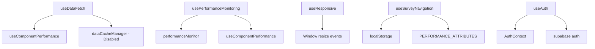

# React Hooks Documentation

This directory contains documentation for all custom React hooks used throughout the A-Player Evaluation System.

## 📚 Hook Categories

### Core Data Hooks
- **[useDataFetch](./useDataFetch.md)** - Advanced data fetching with caching, retries, and performance monitoring
- **[useDataFetching](./useDataFetching.md)** - Simple data fetching utility for basic operations

### Performance Hooks  
- **[usePerformanceMonitoring](./usePerformanceMonitoring.md)** - Component performance tracking and Core Web Vitals monitoring
- **[useChartPerformance](./useChartPerformance.md)** - Specialized performance monitoring for chart components

### UI/Layout Hooks
- **[useResponsive](./useResponsive.md)** - Screen size detection and responsive design utilities
- **[useChartHeight](./useChartHeight.md)** - Dynamic chart height calculation based on screen size

### Survey Hooks
- **[useSurveyNavigation](./useSurveyNavigation.md)** - Survey state management and navigation logic

### Context Hooks
- **[useAuth](./useAuth.md)** - Authentication state and actions
- **[useBreadcrumbs](./useBreadcrumbs.md)** - Breadcrumb navigation generation
- **[useNotifications](./useNotifications.md)** - Notification system management

### Utility Hooks
- **[useAsyncOperation](./useAsyncOperation.md)** - Generic async operation handling with loading states

## 🏗️ Hook Architecture

### Hook Organization
```
src/
├── hooks/                    # Core custom hooks
│   ├── useDataFetch.ts      # Main data fetching hook
│   └── usePerformanceMonitoring.ts
├── utils/                   # Utility hooks
│   ├── useResponsive.ts     # Responsive design
│   └── useDataFetching.ts   # Simple data fetching
├── contexts/                # Context-related hooks
│   ├── AuthContext.tsx      # useAuth
│   └── PerformanceContext.tsx
└── components/ui/           # Component-specific hooks
    ├── Breadcrumb.tsx       # useBreadcrumbs
    ├── Notification.tsx     # useNotifications
    └── survey/
        └── useSurveyNavigation.ts
```

### Hook Dependencies


## 🎯 Usage Patterns

### Data Fetching Pattern
```typescript
// Advanced data fetching with caching and retries
const { data, loading, error, refetch } = useDataFetch(
  () => fetchEmployeeData(employeeId),
  [employeeId],
  {
    enabled: !!employeeId,
    cacheKey: `employee-${employeeId}`,
    cacheTTL: 5 * 60 * 1000,
    retryCount: 3
  }
);
```

### Performance Monitoring Pattern
```typescript
// Component performance tracking
const { measureRender, getPerformanceInsights } = usePerformanceMonitoring({
  componentName: 'EmployeeAnalytics',
  trackRenders: true,
  trackEffects: true
});

// Measure expensive operations
const results = measureRender(() => processAnalyticsData(data), 'dataProcessing');
```

### Responsive Design Pattern
```typescript
// Responsive UI adaptation
const { isMobile, isTablet, breakpoint } = useResponsive();
const chartHeight = useChartHeight(500);

return (
  <div className={isMobile ? 'mobile-layout' : 'desktop-layout'}>
    <Chart height={chartHeight} />
  </div>
);
```

## ⚡ Performance Considerations

### Memoization Strategy
- All hooks use `useCallback` for stable function references
- Dependency arrays are carefully managed to prevent unnecessary re-renders
- Performance monitoring hooks track their own overhead

### Caching
- `useDataFetch` includes built-in caching (currently disabled pending implementation)
- Cache keys are automatically generated based on dependencies
- TTL-based cache invalidation

### Memory Management
- All hooks properly clean up subscriptions and timers
- AbortController used for canceling in-flight requests
- LocalStorage is used judiciously with cleanup on unmount

## 🧪 Testing

### Hook Testing Strategy
```typescript
// Example test structure for hooks
import { renderHook, act } from '@testing-library/react';
import { useDataFetch } from './useDataFetch';

test('should fetch data successfully', async () => {
  const mockFetch = jest.fn().mockResolvedValue({ data: 'test' });
  
  const { result } = renderHook(() => 
    useDataFetch(mockFetch, [], { enabled: true })
  );
  
  await act(async () => {
    await result.current.refetch();
  });
  
  expect(result.current.data).toEqual({ data: 'test' });
});
```

## 📋 Development Guidelines

### Creating New Hooks
1. **Purpose Definition**: Clearly define the hook's single responsibility
2. **TypeScript Interfaces**: Always define proper TypeScript interfaces for options and returns
3. **Error Handling**: Include comprehensive error handling and user feedback
4. **Performance**: Consider the performance impact and add monitoring if needed
5. **Documentation**: Document the hook following the established template

### Hook Naming Convention
- Use descriptive `use` prefix: `useDataFetch`, `usePerformanceMonitoring`
- Avoid generic names: prefer `useEmployeeData` over `useData`
- Include context when applicable: `useSurveyNavigation`, `useChartPerformance`

### Dependencies Management
- Minimize external dependencies
- Use built-in React hooks when possible
- Abstract complex logic into services when hooks become too large

---

## 🔗 Related Documentation
- [ARCHITECTURE.md](../ARCHITECTURE.md#hooks) - System architecture overview
- [Component Documentation](../components/) - Component-specific hook usage
- [Performance Guide](../DEPLOYMENT.md#performance-considerations) - Performance best practices
